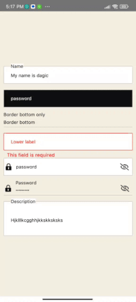

# React Native Floating Label Input

## About The Package

 This is React Native package full customizable and its props extends from [React-native textinput props](https://reactnative.dev/docs/textinput#props). If you your label floats in the text input while focusing or in blur this is the perfect package and also multiple examples to full fill your expecations.💅🎉
## Getting Started

`npm install react-native-floating-inputs` 

or using yarn

`yarn add react-native-floating-inputs`

## support us
[☕  Buy me a coffee](https://www.buymeacoffee.com/dagizewdudc)

- You can also give as star to our repo.
## Authors

### Author 1

👤 **Dagmawi Zewdu**

 - GitHub: [@Dagic-zewdu](https://github.com/Dagic-zewdu)
- LinkedIn: [Dagi-Zewdu](https://www.linkedin.com/in/dagic-zewdu/)

### Author 2

👤 **Sentayhu Berhanu**

- GitHub: [@sentayhu19](https://github.com/sentayhu19)
- LinkedIn: [sentayhu-berhanu](https://www.linkedin.com/in/sentayhu-berhanu-6376579a/)

<!-- CONTRIBUTING -->
## Contribution

If you have a suggestion that would make this better, please fork the repo and create a pull request. You can also simply open an issue with the tag "enhancement".
Don't forget to give the project a star! Thanks again!

1. Fork the Project
2. Create your Feature Branch (`git checkout -b feature/AmazingFeature`)
3. Commit your Changes (`git commit -m 'Add some AmazingFeature'`)
4. Push to the Branch (`git push origin feature/AmazingFeature`)
5. Open a Pull Request

(<a href="#top">back to top</a>)

### Built With

* [ReactNative](https://www.typescriptlang.org/)
* [JavaScript](https://www.javascript.com/)

 

